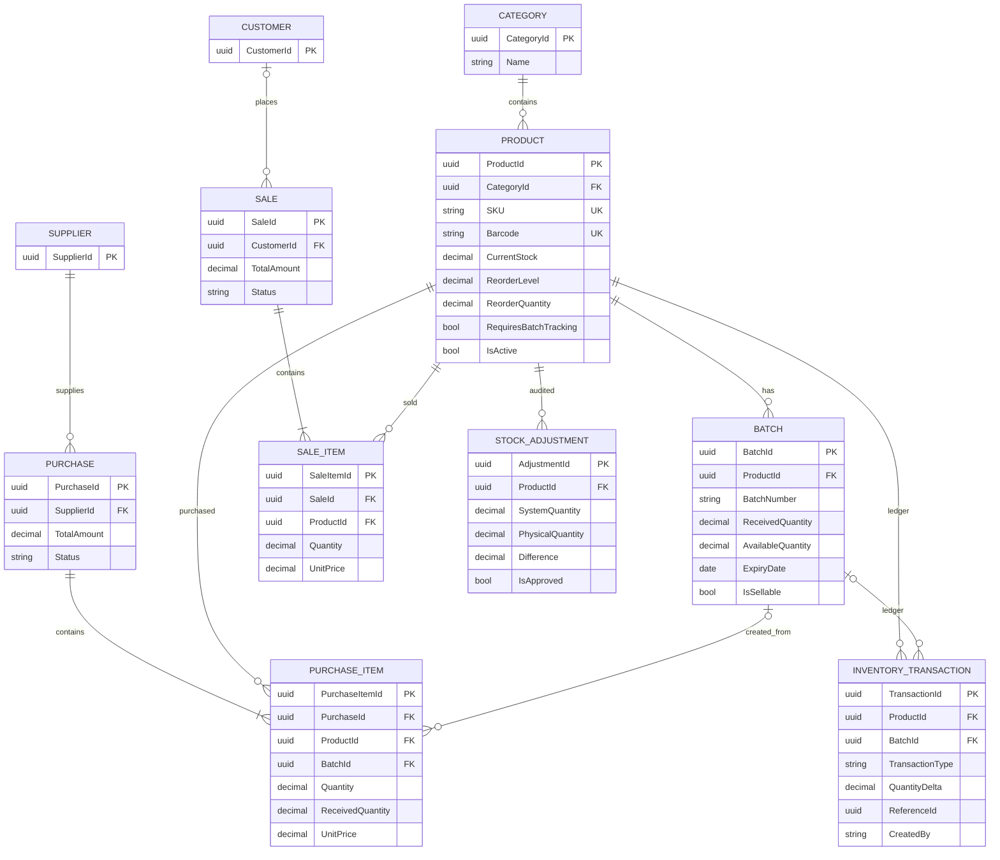

# AI-Powered Store Management System - .NET 10 POC

This repository is a backend Proof of Concept based on the supplied September 2026 requirements document. The document defines a conventional store-management backend first, with AI acting as a controlled assistant over approved application capabilities. The PostgreSQL database and backend business rules remain the source of truth.

## Stack

- .NET 10 / ASP.NET Core Web API
- C# 14
- Entity Framework Core 10
- PostgreSQL via Npgsql
- Layered architecture: API -> Application -> Domain; Infrastructure handles EF Core and data services
- Docker Compose for PostgreSQL

.NET 10 is currently an LTS release and the repository pins the SDK to 10.0.401. The EF PostgreSQL provider is pinned to 10.0.0, which targets .NET 10 and EF Core 10.

## Project structure

```text
StoreManagement.sln
├── src/StoreManagement.Api
│   ├── Controllers
│   ├── Middleware
│   └── Program.cs
├── src/StoreManagement.Application
│   ├── DTOs
│   ├── Interfaces
│   │   └── Data
│   └── Services
├── src/StoreManagement.Domain
│   ├── Entities
│   └── Enums
└── src/StoreManagement.Infrastructure
    ├── Data
    └── DataServices
```

## Database relationships



## Important domain decisions

### 1. Product stock + inventory ledger

`Product.CurrentStock` is maintained for fast reads, but every stock change also creates an `InventoryTransaction`. Inventory transactions are immutable at the EF Core level. This follows the supplied requirement that the ledger is the audit source for stock changes while a current-stock value may be maintained for fast reads.

### 2. Batch and expiry

Batch quantity is tracked with `ReceivedQuantity` and `AvailableQuantity`. Expiry dates live at batch level. Products that have `RequiresBatchTracking = true` must provide a batch number during goods receipt. Sales consume sellable batches using FEFO ordering: earliest expiry first, then receipt time. Expired batches are excluded from normal sales.

### 3. Purchases

`Purchase` stores the header; `PurchaseItem` stores ordered quantities and prices; receiving happens separately. Inventory increases only during `/api/purchases/{id}/receive` and the receive operation runs in a serializable database transaction.

### 4. Sales

`Sale` stores the header and `SaleItem` stores product lines. A completed sale validates stock and creates negative inventory transactions. Batch-tracked products consume multiple batches when required.

### 5. Stock adjustment

Creating an adjustment only records the proposed physical count. Approval is a separate endpoint. Approval recalculates the difference against the latest current stock, updates stock, and creates an `ADJUSTMENT` inventory transaction.

### 6. Return and damage

The POC exposes dedicated movement endpoints. Returns add stock; damage removes stock. Both are ledgered. Purchase and sale movements remain controlled by their dedicated workflows.

## API endpoints

| Method | Endpoint | Purpose |
|---|---|---|
| GET | `/api/products` | List products |
| POST | `/api/products` | Create product |
| GET | `/api/products/{id}` | Get product |
| PUT | `/api/products/{id}` | Update product |
| GET | `/api/categories` | List categories |
| POST | `/api/categories` | Create category |
| GET | `/api/suppliers` | List suppliers |
| POST | `/api/suppliers` | Create supplier |
| POST | `/api/purchases` | Create purchase |
| GET | `/api/purchases/{id}` | Get purchase |
| POST | `/api/purchases/{id}/receive` | Receive goods and create stock-in ledger entries |
| POST | `/api/sales` | Complete a sale and create stock-out ledger entries |
| GET | `/api/sales/{id}` | Get sale |
| GET | `/api/inventory` | Current inventory |
| GET | `/api/inventory/low-stock` | Products below reorder level |
| GET | `/api/inventory/expiring?days=30` | Batches expiring within a window |
| GET | `/api/inventory/expired` | Currently available expired stock |
| POST | `/api/inventory/batches/{id}/expire` | Remove expired batch quantity from sellable stock |
| POST | `/api/inventory/returns` | Record returned stock |
| POST | `/api/inventory/damage` | Record damaged stock |
| POST | `/api/inventory/adjustments` | Create physical-stock adjustment proposal |
| POST | `/api/inventory/adjustments/{id}/approve` | Approve adjustment |
| GET | `/api/dashboard` | Dashboard summary |
| POST | `/api/ai/chat` | Controlled POC assistant |
| GET | `/health` | Health endpoint |

## Getting started

1. Install .NET SDK 10.0.401 or a compatible later 10.0 SDK.
2. Start PostgreSQL:

```bash
docker compose up -d postgres
```

3. From the repository root, create the first EF Core migration:

```bash
dotnet tool install --global dotnet-ef --version 10.0.12
dotnet ef migrations add InitialCreate \
  --project src/StoreManagement.Infrastructure \
  --startup-project src/StoreManagement.Api \
  --output-dir Data/Migrations
```

4. Apply the database:

```bash
dotnet ef database update \
  --project src/StoreManagement.Infrastructure \
  --startup-project src/StoreManagement.Api
```

5. Run the API:

```bash
dotnet run --project src/StoreManagement.Api
```

For Visual Studio 2026, open `StoreManagement.sln`, set `StoreManagement.Api` as the startup project, and start the API.

## Example flow

### Create a supplier

```http
POST /api/suppliers
Content-Type: application/json

{
  "name": "ABC Distributors",
  "phone": "9999999999",
  "email": "sales@abc.example",
  "address": "Pune, Maharashtra",
  "taxRegistrationNumber": "GST-EXAMPLE"
}
```

### Create a batch-tracked product

```http
POST /api/products
Content-Type: application/json

{
  "name": "Rice 5kg",
  "sku": "RICE-5KG",
  "barcode": "890000000001",
  "categoryId": "aaaaaaaa-aaaa-aaaa-aaaa-aaaaaaaaaaaa",
  "unit": "bag",
  "purchasePrice": 250,
  "sellingPrice": 300,
  "reorderLevel": 10,
  "reorderQuantity": 50,
  "requiresBatchTracking": true
}
```

### Create a purchase

```http
POST /api/purchases
Content-Type: application/json

{
  "supplierId": "PUT-SUPPLIER-ID-HERE",
  "items": [
    {
      "productId": "PUT-PRODUCT-ID-HERE",
      "quantity": 100,
      "unitPrice": 250
    }
  ]
}
```

### Receive goods

```http
POST /api/purchases/PUT-PURCHASE-ID-HERE/receive
X-User: store-manager
Content-Type: application/json

{
  "items": [
    {
      "purchaseItemId": "PUT-PURCHASE-ITEM-ID-HERE",
      "receivedQuantity": 100,
      "batchNumber": "BATCH-2026-09",
      "manufacturingDate": "2026-08-01",
      "expiryDate": "2027-08-01"
    }
  ]
}
```

### Complete a sale

```http
POST /api/sales
X-User: cashier-01
Content-Type: application/json

{
  "items": [
    {
      "productId": "PUT-PRODUCT-ID-HERE",
      "quantity": 5
    }
  ]
}
```

## AI integration boundary

The current `/api/ai/chat` implementation is deliberately a controlled POC facade. It only performs read-only application queries for stock, low-stock/reorder, and expiry questions. It does not expose arbitrary SQL or database credentials to an LLM.

When OpenAI, Gemini, or AWS Bedrock is added, the provider should call approved backend tools such as:

- `get_product_stock`
- `get_low_stock_products`
- `get_expiring_products`
- `get_expired_products`
- `get_sales_summary`
- `get_product_sales`
- `get_purchase_history`
- `search_products`

Write operations should stay behind authenticated backend services and explicit confirmation.

## Authentication note

The requirements include authentication and role-based access. This POC uses `X-User` only to make inventory audit flows runnable without introducing an identity provider into the first scaffold. Before production use, replace this with ASP.NET Core authentication/authorization and role policies, and derive `CreatedBy`/`ApprovedBy` from authenticated claims rather than request headers.

## Next implementation phases

1. Add ASP.NET Core Identity/JWT and roles (`Owner`, `Manager`, `Staff`).
2. Add proper validation with FluentValidation or endpoint validators.
3. Add EF Core migration files to source control after running `dotnet ef migrations add`.
4. Add richer reporting and sales-history queries.
5. Replace the POC AI facade with Microsoft.Extensions.AI or Semantic Kernel plus provider-specific tool calling.
6. Add MCP only around approved store-management tools, not direct database access.
7. Add integration tests covering purchase receipt -> batch -> sale -> ledger consistency.
